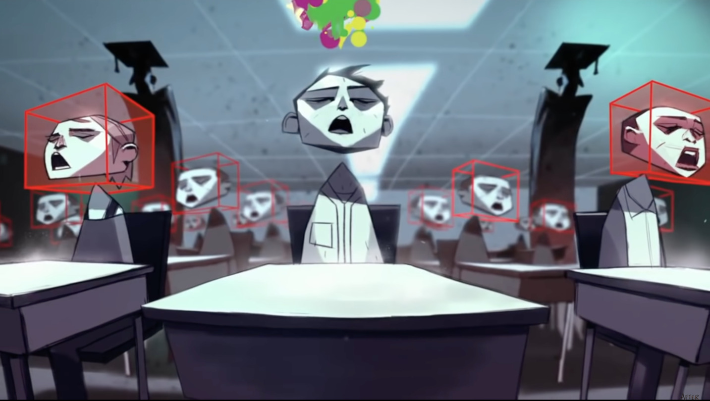
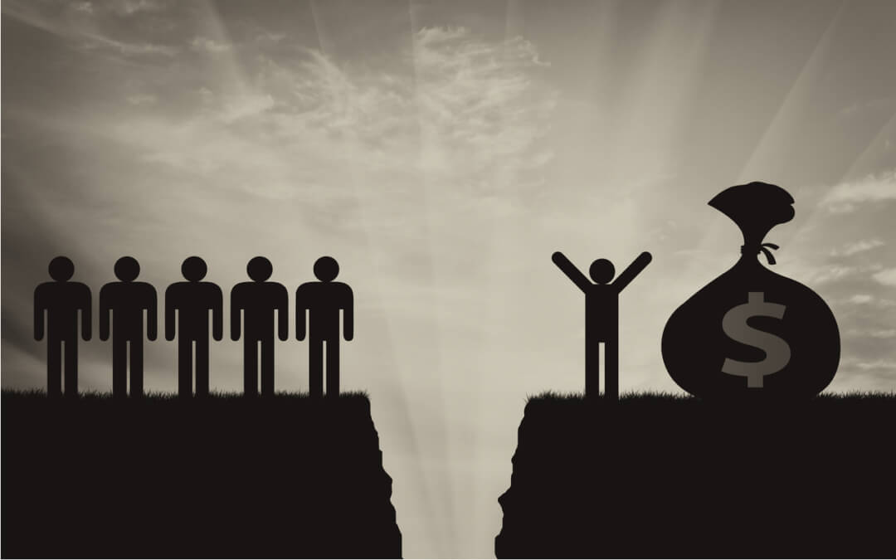

# Why FreeFlow 

   "Our Freedom is closing. If you don't fight for it every day, you lost it" - Carlito Dalceggio

There is no doubt, we live at a crossroad. Technology & Innovation are taking an important role in our society. We are more devoted to technology but however, the actual and current system is using it with a different vision. A vision where technology is turning us into easily manipulated products/human beings - where mass surveillance and command & control play a major role - where education brings students into boxes instead of opening their mind - where inequality has never been obvious as before - Where rulers spend countless billions of dollars on warfare, hatred, fear, suspicion and division. We are living in an environment where we have severed our connection with spirit. 

# Our education system is failing 

Our educational system actually limits the children's thoughts instead of opening their mind to different perspectives. Most of the information doesn't serve them as individuals, they lack socials skills and do not understand how important their relationships with the exterior enviroment and nature are. It is based on the theory of "Survival of the Fittest" where competition, Pyramids Scheme and Exploitation are favored to Collaboration, Participatory and Regeneration respectively. 

# Unequal distribution of wealth 

Below are some facts that may ring the bell: 
- The world’s richest 1% have more than twice as much as 6.9 billion people
- Almost half of humanity is living on less than $5.50 a day
- Underfunded public services - 258 million children and yet, only 1 out every 5 will not be allowed to go to school
- Every day, 10,000 people die because they lack access to affordable healthcare 
- Men own 50% more of the world’s wealth than women, and the 22 richest men have more wealth than all the women in Africa.
Amount spent on defence globally went up to $1.83 trillion.

# We are turned into product 

With the current internet infrastructure, our data is stored in data centers owned by big tech corporation. These data are sold, without our approval, to third parties like Companies and Governments. With the data collection, they make representations of us and we don't own them - Actually internet users may have hundreds or thousands of digital identities held by those entities. 

As a matter of fact, the data industry has thousands of data points on digital users and a user combined data points are worth between $1 to $20k per year. All of these data points are collected to build tailor-targeted ads. 

