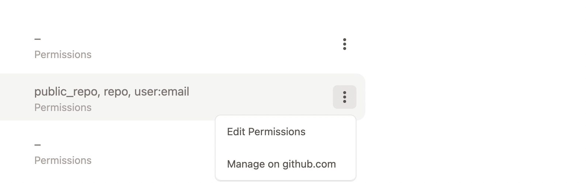

# Gitpod 

## get an account on github

... to be further documented

## get an account on gitpod.

go to https://www.gitpod.io/#get-started

Click to continue with github,

go to https://gitpod.io/integrations

click on manage on github.com

> recommended: Add gitpod extension to your browser

>TODO: complete
