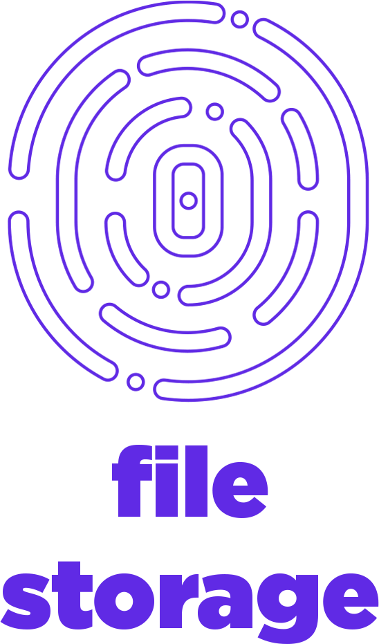

# Capabilities 

On FreeFlow, you will find all essential tools you need to connect between each others. User will have access to chat, video conferencing, file storage, office and browser tools as part of the main capabilities. 

All of these capabilities have been built top of a peer-to-peer, decentralized and fully secured infrastructure where you will be the owner of the data with no intermediaries. 

# FreeFlow 

FreeFlow is your 2-authenticator app that acts as a portal towards your new digital universe. 

> FreeFlow will soon be available on Android and Apple. Stay Tune!

## FreeFlow Chat 

A fully decentralized peer-to-peer chat system that allows you to connect with your loved ones without any intermediaries. All your data is owned by you. 

## FreeFlow Connect  

Have face-to-face conversations with your loved ones - From family meetings and group hangouts to yoga classes and collaborative sessions - everything can happen on FreeFlow Connect. 

## AYDO = All Your Data Online

The purpose of AYDO is to provide everyone with a data sovereign and private file storage facility to safely store, retrieve, create, edit and share your personal digital files. 

# FreeFlow Wallet 

FreeFlow Wallet provides you with a multi-currency wallet that allows you to buy, receive, send, and store your favorite digital currencies all in one place. Benefit from a wide array of projects to find the value you really care about and start your digital asset journey. 

