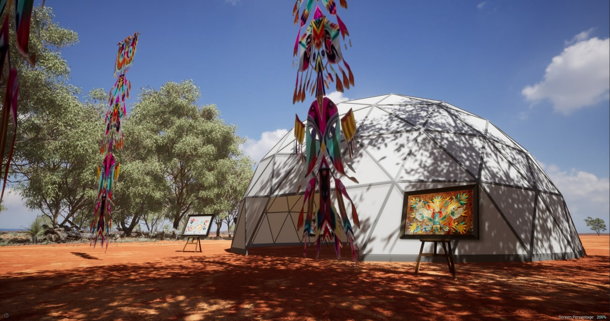
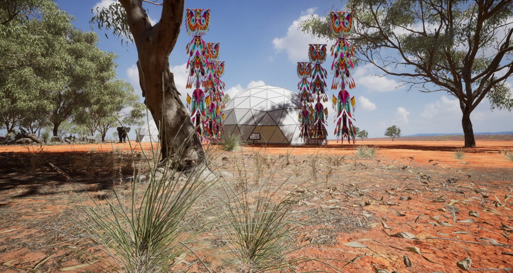

# FreeFlow Space

FreeFlow Space is a virtual environment designed for creativity and self-expression. It is an area where artists with vast inspirations showcase their artworks. It is an experience for creation, expression, and learning where art and education cross paths. Built on top of the [ThreeFold Grid](threefold:grid_intro), the space is also dedicated to show to the users how real peer-to-peer communication works on the people's internet and how digitally the gift of information and knowledge can be achieved. 

## Preview

An environment that emerges the user completely in a space of freedom and security

## How to 

This section will show and guide you on how to download, install and enjoy the FreeFlow Space experience. 

### Pre-requisite   

First, users will need: 

<!--- ThreeFold Connect App
ThreeFold Connect App is your highly secured authentication app, which will be used to log-in onto your FreeFlow Space. The users need to download it on your smartphone using the following link: 
* For Android [here](https://play.google.com/store/apps/details?id=org.jimber.threebotlogin&hl=en&gl=US)
* For IOS [here](https://apps.apple.com/us/app/threefold-connect/id1459845885)-->

- Artheon Software Package 

Before accessing the FreeFlow Space, user will need to download Artheon Software package on their computer. 

Downloading links as per Operating System: 
- For **MacOS**: [click here](https://drive.google.com/file/d/13L6rt0U8X-RFPOM9PHwpYk63PfITi6J7/view?usp=sharing)
- For **Linux**: [click here](https://release.test.artheon.co/linux/LinuxNoEditor.zip)

### How to access - offline 

1. Install the Artheon Software Package 

2. After Installation, run the software (User will need internet connection)

3. Now, you are inside the FreeFlow Space. 

> Please note that the downloaded version is still in Beta mode.
