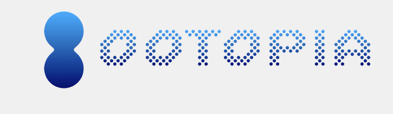
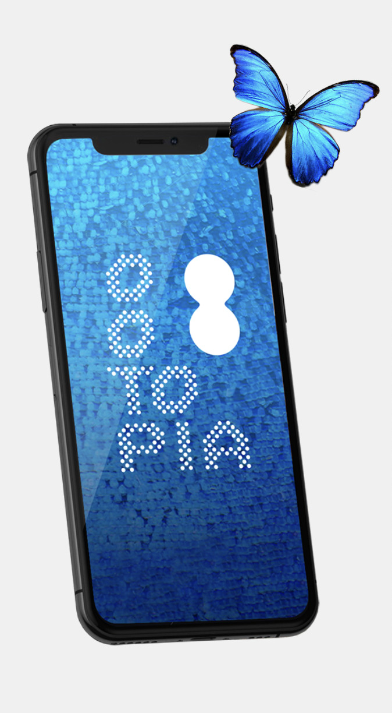
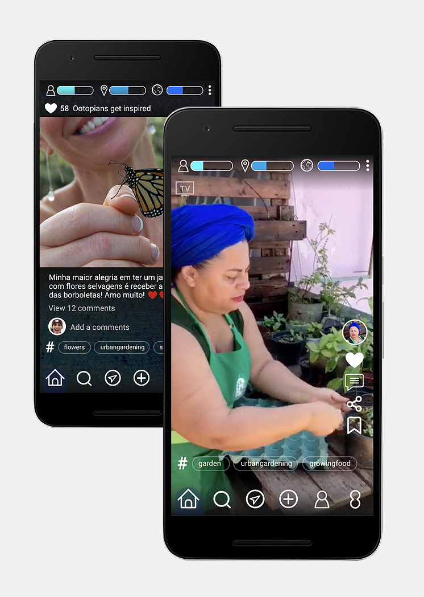

# Ootopia 

> Image 

Ootopia is a place where the convergence of the regenerative movement happens by combining on a single experience an inspiring social network, a learning platform on regen skills and an ethical marketplace.

Because this new world is already flourishing in many places at the hands of amazing people working for regeneration, we believe that the way to overcome global, economic, political, social, and environmental crises is possible through promoting collaboration, exchange knowledge, and the sum of skills.

Ootopia is built on FreeFlow and hosted on the people’s internet as you cannot build a regenerative movement on top of a centralized technology that is actually harming the planet. Ootopia strongly believes in giving back to people the choices and freedom to build another world. Also, regenerating the world comes with a bigger picture where the awakening of everyone self through healing and art. 

Technically speaking, Ootopia will be combining FreeFlow main capabilities(stream, chat, wallet or marketplace) with the purpose of creating a unique experience. Everyone on OOTOPIA will have a FreeFlow Self and therefore be part of the FreeFlow universe. Also everyone with a FreeFlow Self will be able to be part of Ootopia. 

## Preview 

> Ootopia will be available soon! 

In the meantime, feel free to visit Ootopia Website [here](https://www.ootopia.org/).