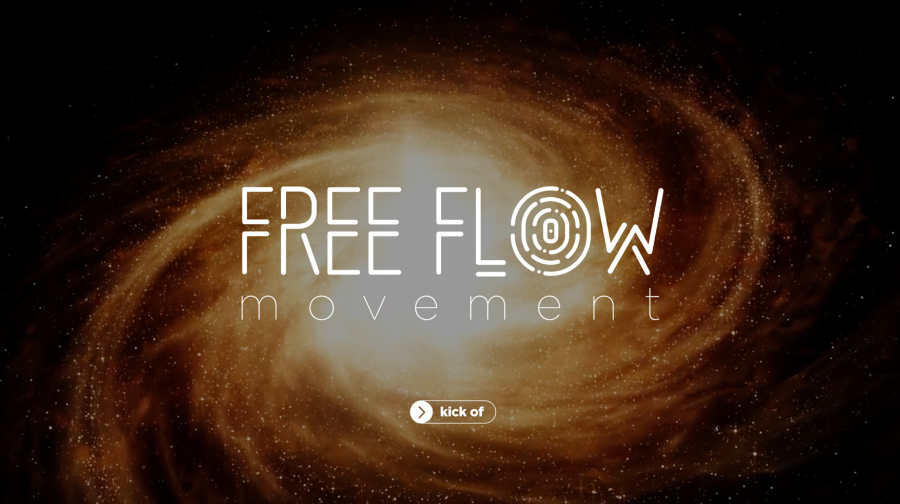

# FreeFlow 

FreeFlow is a digital Earth 4.0 where people will be able to embrace new experiences on the first peer-to-peer internet. By being gifted with a unique digital identity, [FreeFlow Self](freeflow_self), you will have access to your new digital environment that prevails security, privacy, trust and freedom - It is your safe space for self-expression, self-discovery, learning and sharing of knowledge. 

Along with the Capabilities and Experiences, users will be able to discover, create and share different levels of realities. Moreover, FreeFlow has the aim of providing the space of people to access information and knowledge without restrictions and borders.

# Mission 

Our mission is to provide a global accessibility to tools and experiences that allow everyone to access information and knowledge without borders and discover a true humanized way to communicate & connect with each other, create, exchange, learn, teach and share on this new digital universe. Through an ecosystem project collaboration, we are providing the key drivers for prosperity, equality, sharing, happiness and the advancement of human civilization. 

It is a movement that helps in reconstructing the link between us and nature, between our inner and outer world. A bridge between digital and physical world. 

# Technology

Built on top of the new peer-to-peer internet, [ThreeFold Grid](threefold:grid_intro), it provides us with the possibily to scale up our solution and, thus, providing a complete user experience in the a fully secure, private and sustainable environment while being data sovereign.

   A step towards freedom

<iframe width="560" height="315" src="https://vimeo.com/554359372" frameborder="0" allow="accelerometer; autoplay; encrypted-media; gyroscope; picture-in-picture" allowfullscreen></iframe>
   
Learn more: 

- [Capabilities](capabilities)
- [Experiences](experiences_intro_freeflow)

