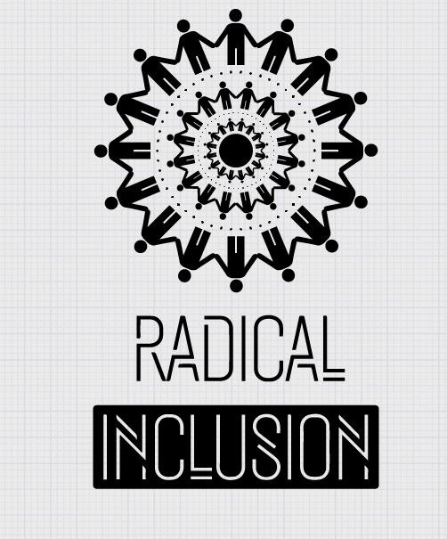
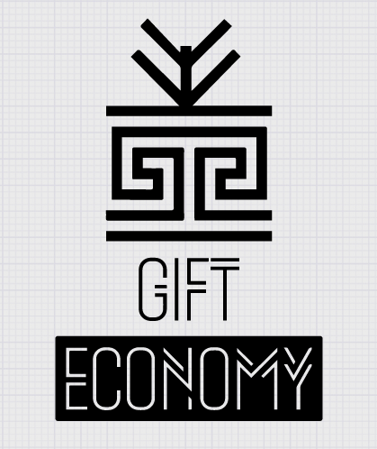
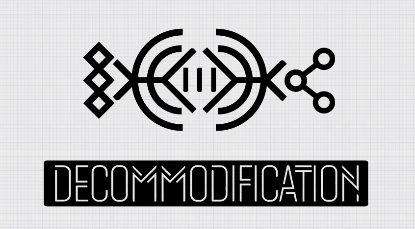
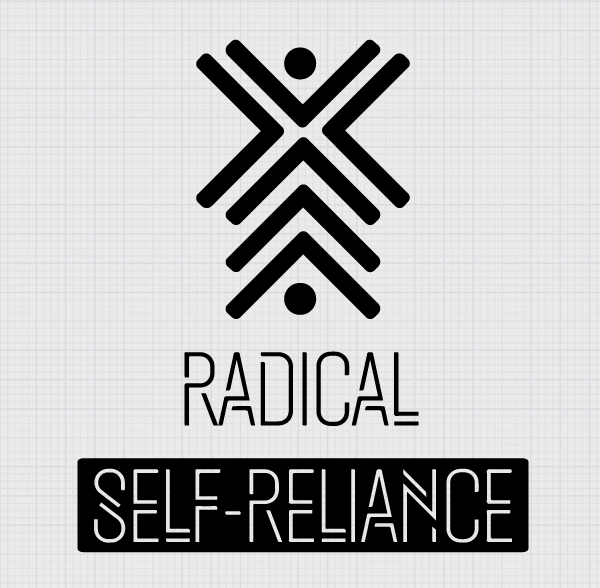
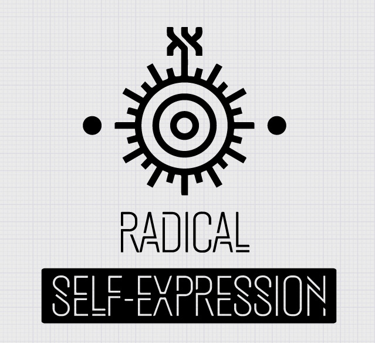
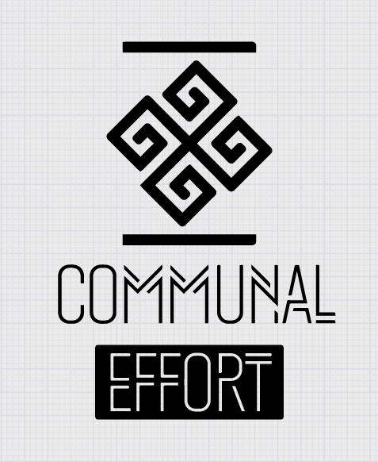
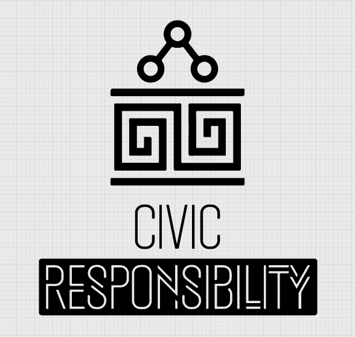
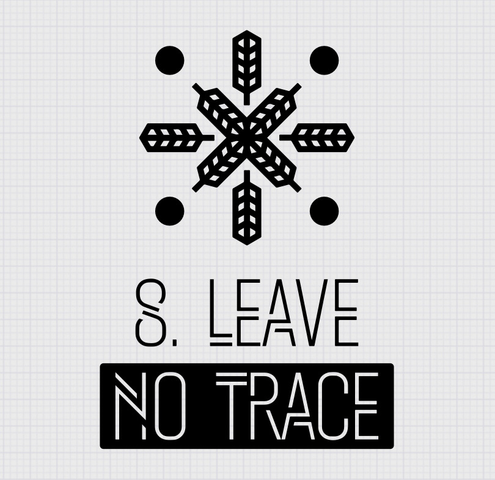
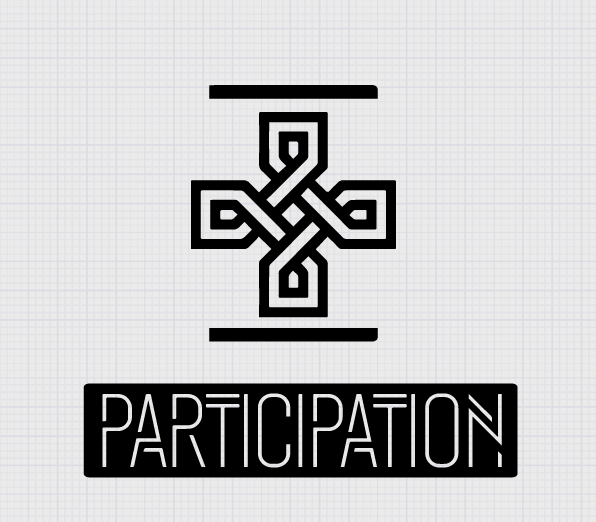
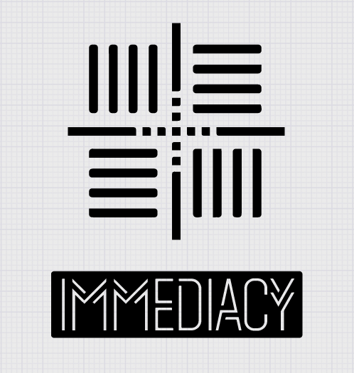

# FreeFlow Principles 

“If not US, then who? If not NOW then when?” 
Anyone may be a part of FreeFlowCommunity. We welcome and respect the stranger. No pre-requisites exist for participation in our community.

FreeFlow is devoted to acts of Gift Giving. The value of a Gift is unconditional. Gifting does not contemplate a return or an exchange for something of equal value.

GIFT ECONOMY = BALANCE
The introduction of an evolutionary new gift economy wherein the gift of giving is the value each giver receives - nothing is expected in return. 

In order to preserve the spirit of Gifting, our FreeFlow Community seeks to create online social environments that are unmediated by commercial sponsorships, transactions, or advertising. We stand ready to protect our culture from such exploitation. We resist the substitution of consumption for Participatory Experience.

FreeFlow encourages the individual to discover, exercise and rely on his or her inner resources.

Radical Self-Expression arises from the unique Gifts of the Individual. No one other than the individual or a collaborating group can determine its content. It is offered as a Gift to others. In this spirit, the Giver should respect the rights and liberties of the recipient.

"We are to take Individual Self-Expression as far as WE possibly can and Dream into Reality a much better World!!! Express yourselves. Start doing the things you love. Life is simple. Open your heart, mind and arms to new things and new people. WE are United in our differences..."

Our FreeFlow Community values creative cooperation and collaboration. We strive to produce, promote and protect social networks, public spaces, works of art, and methods of communication that support such interaction.
Quote: We honour tribalism.

We value civil society. Community members who organize events should assume responsibility for public welfare and endeavor to communicate civic responsibilities to participants. They must also assume responsibility for conducting events in accordance with local, state and federal laws.

"We return to Responsible Community Building"

Our community respects the Environment. We are committed to leaving no physcial trace of our activities in whatever we do and participate in the regeneration of the planet. We commit to Cleaning up the Earth for future generations. 

Our FreeFlowCommunity is committed to a Radically Participatory Ethic (RPE). We believe that transformative change, whether in the individual or in society, can occur only through the medium of deeply personal participation. We achieve being through doing. Everyone is invited to work. Everyone is invited to play. We make the world real through actions that open the heart.

Immediate Experience is, in many ways, the most important touchstone of value in our culture. We seek to overcome barriers that stand between us and a recognition of our inner selves, the reality of those around us, participation in society, and contact with a natural world exceeding human powers. No idea can substitute for this Experience.
