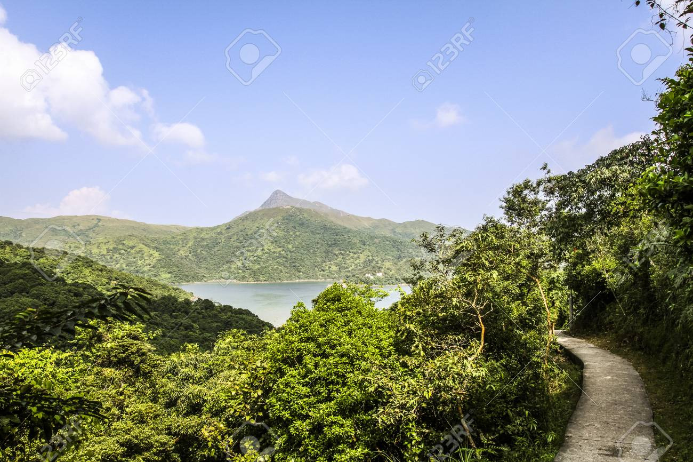

# Jungle and the Sea Story

- you know the end goal
- you know the direction
- you are in jungle
  - plan your walk for the day only, no need to think further
  - keep your team together even when its a not so good day (rain, wrong path, dead end)
  - **only accept positive energy**
  - accept that there will be days where no progress was made, or even worse we went in wrong path
  - determinism about there is an end to the jungle, we know the direction, as long as we follow that direction we will end to our destination, always

> TODO: kristof